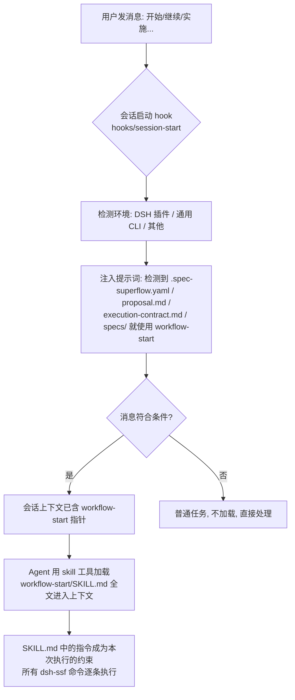
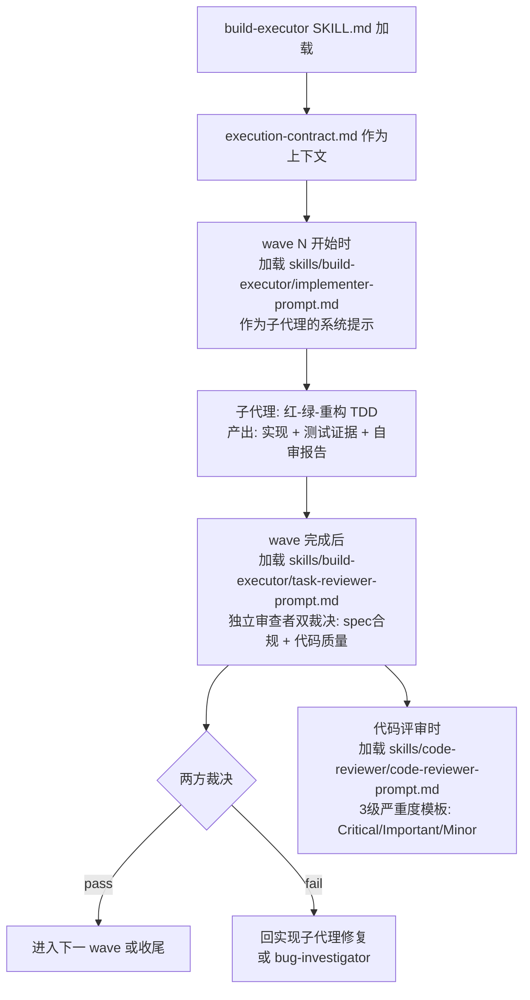
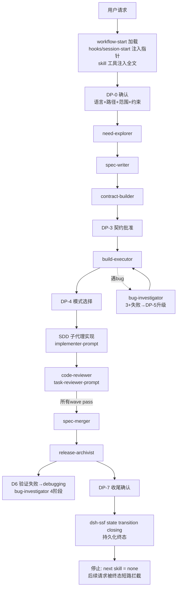

# workflow-start 执行流程与 skill 加载流程

本文用流程图逐步说明:workflow-start 开始后的执行过程,以及各 skill 的加载与执行过程。适用于理解 dsh-ssf 的调度机制(状态机详见 [state-machine.md](state-machine.md))。

## 第 0 步:skill 是怎么被加载的(加载机制)

`workflow-start` 不是被主动 import 的,而是**环境注入 + 按需加载**两层:



关键点: DSH 插件与通用 CLI 共用同一份 `SKILL.md`（历史曾覆盖 Claude Code / Cursor / Codex / Copilot / Gemini / OpenCode / WorkBuddy / Trae 等九个平台，已剥离为 DSH-only，仅保留 DSH 插件与 CLI 路径；历史平台差异仅在 hook 注入的输出格式 `additionalContext` vs `hookSpecificOutput`）。

## 第 1 步:workflow-start 执行过程(内部 7 个步骤)

```mermaid
flowchart TD
    S[workflow-start SKILL.md 加载完毕] --> A[① 终态短路检测<br/>读 .spec-superflow.yaml 的 state]
    A -->|state = closing / abandoned| TERM[🛑 停止<br/>输出标准报告: 当前状态+证据+next=none<br/>不跑任何后续步骤]
    A -->|非终态| B[② 初始化]
    B --> B1[dsh-ssf runtime check-update<br/>退出码 0=继续 1=提示升级 2=跳过]
    B --> B2[检查 change 目录内容<br/>proposal.md? specs/? design.md? tasks.md?<br/>execution-contract.md? 用户批准过契约吗?]
    B2 --> C[③ Overlay 恢复扫描<br/>dsh-ssf handoff list + dsh-ssf checkpoint list]
    C -->|有 result-ready handoff| C1[先让用户 review + dsh-ssf handoff resolve<br/>才能恢复受影响工作]
    C -->|无| D[④ Execution-control 恢复扫描<br/>仅 Full/legacy Hotfix 在 approved-for-build/<br/>executing/debugging 时: dsh-ssf execution show]
    D --> D1{current:true 且<br/>waves[].eligible:true?}
    D1 -->|是| E[可以开工 wave]
    D1 -->|否| E
    E --> F{⑤ 快速路径?<br/>Quick ≤3文件 / Hotfix ≤2文件 / Tweak ≤4配置}
    F -->|是| FP[直接推荐+同一轮接受<br/>dsh-ssf workflow accept --verification tdd|new-test|bounded<br/>跳过规划工件/契约/DP-4/评审receipt]
    F -->|否| G[⑥ DP-0 确认门<br/>1. 工件语言解析<br/>2. workflow show 收集缺失事实<br/>3. workflow recommend 展示<br/>Observed/Recommended/Why<br/>4. 用户显式选择并确认<br/>5. state set dp_0_confirmed true]
    G --> H[⑦ 按状态路由 + 过期检测<br/>见第 2 步流程图]
```

## 第 2 步:路由决策(调用哪个 skill)

```mermaid
flowchart TD
    R[状态判定完成] --> X{内容级检查}
    X -->|契约过期: proposal范围超出契约| RW1[强制回退 → contract-builder]
    X -->|工件漂移: 能力无spec / spec无能力| RW2[强制回退 → spec-writer]
    X -->|tasks缺失| RW2
    X -->|executing中遇bug| BUG[🛑 最高优先 → bug-investigator<br/>4阶段: 根因→模式→假设→修复<br/>修复后路由回 build-executor]
    X -->|state = exploring| N1[need-explorer<br/>一问一答式澄清需求]
    X -->|state = specifying| N2[spec-writer<br/>生成4个规划工件+schema校验]
    X -->|state = bridging| N3[contract-builder<br/>解析引擎抽取4工件→压缩契约<br/>挂 DP-3 批准门]
    X -->|state = approved-for-build| N4[build-executor<br/>DP-4: recommend→plan→show<br/>确定 Inline/Batch Inline/SDD]
    X -->|state = executing| N5{build-executor 执行中}
    N5 -->|wave 实现完成| N6[code-reviewer<br/>写 review receipt pass/fail<br/>用 task-reviewer-prompt 双裁决]
    N5 -->|全部 wave pass| N7[spec-merger<br/>delta spec 合并主specs]
    N7 --> N8[release-archivist<br/>验证(DP-6)→审计→DP-7→closing]
    N1 --> N2 --> N3 --> N4 --> N5
```

## 第 3 步:被路由的 skill 如何执行(以 Full 路径为例)

每个 skill 都是同一模式:**加载 SKILL.md → 跑 CLI 命令 → 产出工件 → guard 交回 workflow-start**。

```mermaid
flowchart LR
    A[workflow-start 路由] -->|①| B[need-explorer<br/>SKILL.md 加载<br/>一问一答澄清]
    B --> B1[输出: 稳定的需求定义]
    B1 -->|guard: exploring→specifying| C[spec-writer<br/>生成 proposal/specs/design/tasks<br/>每次生成跑 schema 校验]
    C --> C1[输出: 4 个规划工件]
    C1 -->|guard: specifying→bridging| D[contract-builder<br/>解析引擎抽取→execution-contract.md]
    D --> D1[DP-3 用户批准契约]
    D1 -->|guard: bridging→approved-for-build| E[build-executor]
    E --> E1[DP-4 执行模式: recommend→plan→confirm]
    E1 --> E2{模式选择}
    E2 -->|Inline| F1[Agent 自己 TDD 实现]
    E2 -->|SDD| F2[加载 implementer-prompt.md<br/>派子代理实现<br/>子代理交回 TDD 证据+自审]
    E2 -->|Batch Inline| F3[按批次串行实现]
    F1 & F2 & F3 --> G[每个 wave 后<br/>加载 task-reviewer-prompt.md<br/>code-reviewer 双裁决]
    G -->|verdict pass| H[spec-merger 合并 delta specs]
    H --> I[release-archivist<br/>验证→审计→DP-7]
    I --> J[执行 dsh-ssf state transition closing<br/>持久化终态]
```



## 第 4 步:子代理(prompt 文件)的加载时机

SDD 模式下的两级加载:



## 端到端总览(Full + SDD 全流程)



## 要点总结

1. **加载顺序**:hook 注入"指针" → skill 工具把 SKILL.md 全文注入 → 指令变成执行约束
2. **每个 skill 切换 = 一次 guard 检查 + 一次 DP 审批**,过不了就 BLOCK,绝不静默跳过
3. **子 prompt 只在执行时按需加载**:实现时 implementer-prompt,评审时 task-reviewer-prompt / code-reviewer-prompt
4. **closing 是终点**:一切路由、扫描、恢复在终态前全部短路停止

## 相关文档

- [state-machine.md](state-machine.md) — 8 状态正式定义与转换规则
- [artifact-contract.md](artifact-contract.md) — 工件角色与规划到执行的映射
- [decision-points.md](decision-points.md) — DP-0 ~ DP-7 决策点协议
- [platform-matrix.md](platform-matrix.md) — DSH 插件说明（历史多平台矩阵已归档，仅保留 DSH）
